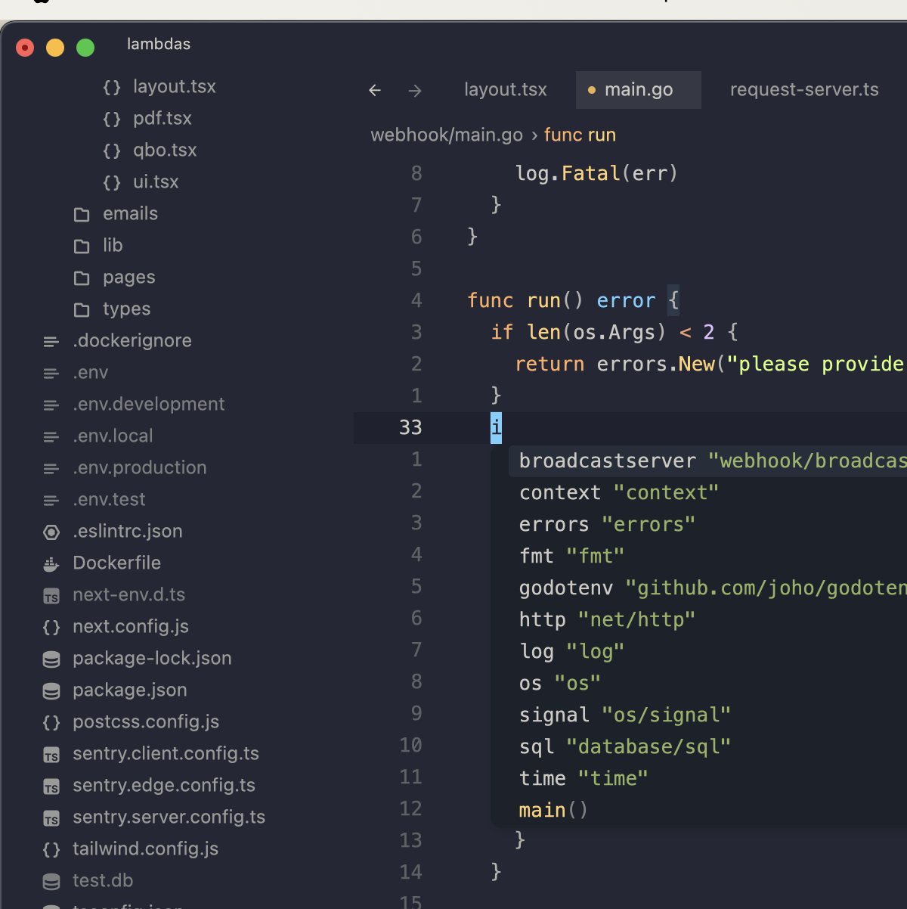
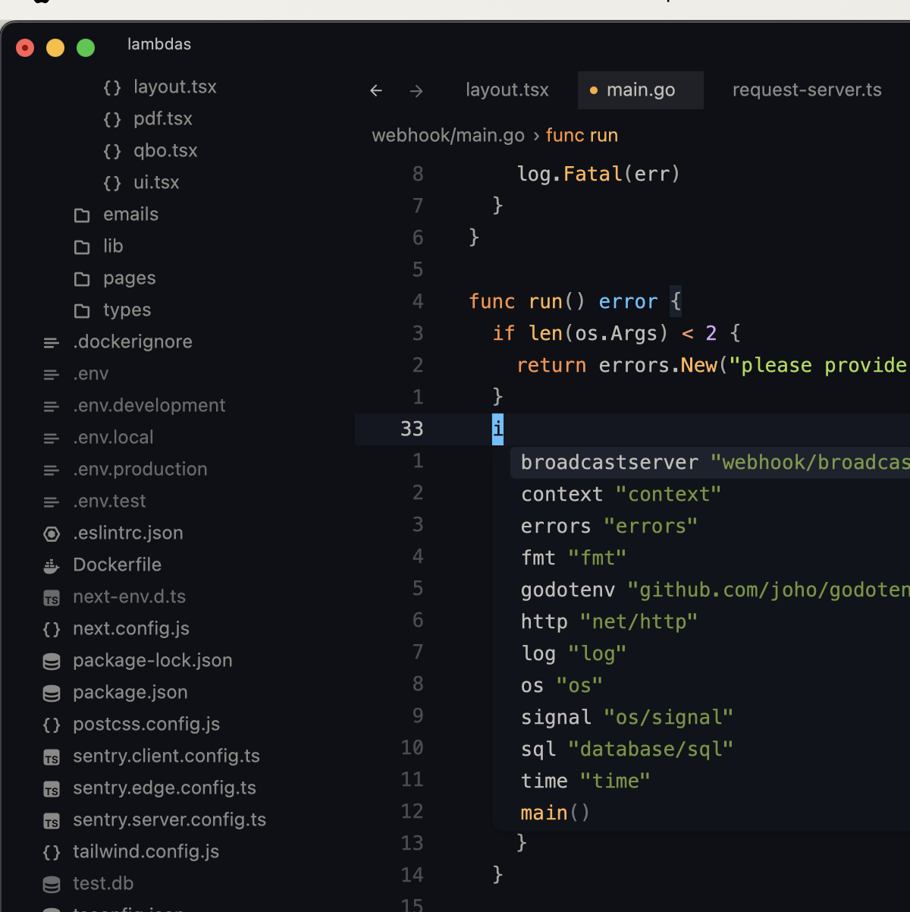
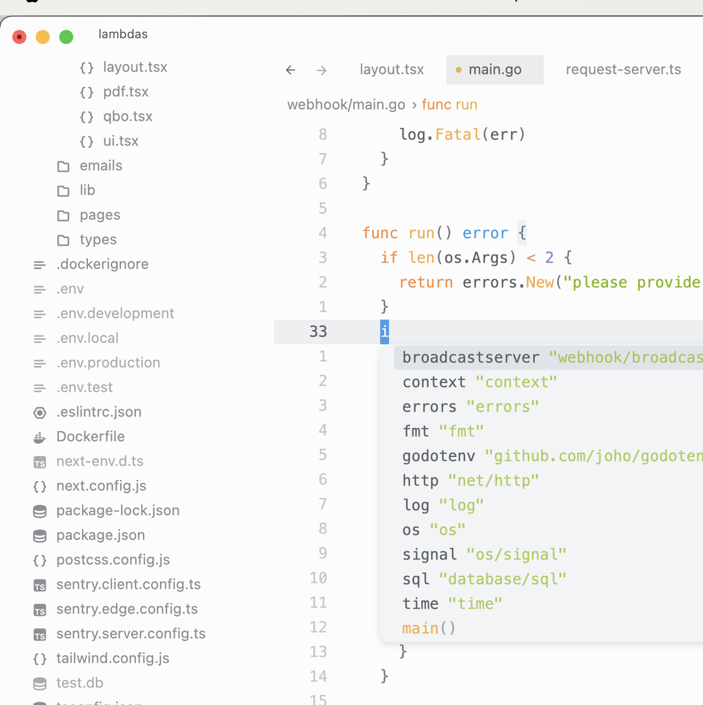

# Ayu Borderless Themes for the Zed Code Editor

This repo contains 3 Ayu BorderLess themes for [Zed](https://zed.dev).

## Installing

- Copy the `.json` files from this repo into `~.config/zed/themes`.
- Select your theme (Settings -> Select Theme).

### Ayu BorderLess

Just Zed's Ayu theme with the borders removed to look more like the Ayu themes in VSCode

